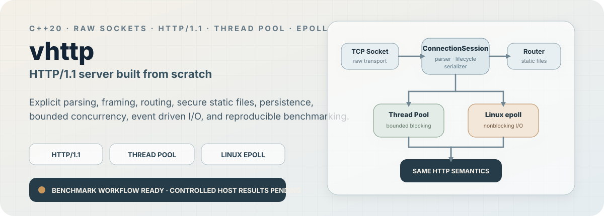

<p align="center">
  
</p>

<p align="center">
  <a href="https://github.com/VivekVRobo/http-server-from-scratch/actions/workflows/linux.yml"></a>
  <a href="https://github.com/VivekVRobo/http-server-from-scratch/actions/workflows/windows.yml"></a>
  
  
  
  
</p>

<p align="center">
  <strong>A cross platform C++20 HTTP server built from raw sockets so protocol parsing, framing, routing, connection lifecycle, secure static files, concurrency, event driven I/O, and performance verification remain visible and testable.</strong>
</p>

> [!IMPORTANT]
> **Current evidence boundary:** the blocking and bounded thread pool runtimes plus the Linux `epoll` runtime share the same HTTP connection state machine, and the comparative benchmark workflow is implemented. No runtime performance winner or universal throughput claim is made until reviewed controlled host evidence is published.

<p align="center">
  <a href="docs/ARCHITECTURE.md"><strong>Architecture</strong></a> ·
  <a href="docs/SECURITY.md"><strong>Security</strong></a> ·
  <a href="docs/PERFORMANCE.md"><strong>Performance Methodology</strong></a> ·
  <a href="benchmark-results/README.md"><strong>Benchmark Evidence</strong></a> ·
  <a href="docs/RELEASE_READINESS.md"><strong>Release Gate</strong></a>
</p>

---

## What Is Implemented

| Surface | Evidence | Status |
| --- | --- | :---: |
| **Raw socket transport** | Winsock2 and POSIX abstractions | ✅ |
| **Incremental HTTP parsing** | HTTP/1.0 and 1.1 across arbitrary TCP reads | ✅ |
| **Content Length framing** | Bounded body handling | ✅ |
| **Chunked transfer decoding / encoding** | Extensions, trailers, ambiguity checks | ✅ |
| **Routing** | Method aware trie, params, 404, 405, OPTIONS, HEAD | ✅ |
| **HTTP persistence** | Keep alive and pipelined request lifecycle | ✅ |
| **Secure static files** | Traversal, encoding, symlink, validators, ranges | ✅ |
| **Bounded thread pool** | Fixed workers, bounded queue, drain, counters | ✅ |
| **Linux epoll runtime** | Nonblocking readiness, backpressure, partial writes | ✅ |
| **Cross platform verification** | GCC, Clang, MSVC workflows | ✅ |
| **Comparative benchmark tooling** | Repeated threadpool vs epoll workflow | ✅ Implemented |
| **Controlled host performance result** | Reviewed repeated evidence bundle | ◐ Pending |
| **Production internet readiness** | Broader fuzzing, soak, hardening | ❌ Not claimed |

This is an engineering server, not a production ready reverse proxy.

---

## Architecture

```text
                         handler / router / static files
                                   ^
                                   |
                           ConnectionSession
                       parser + lifecycle + serializer
                          ^                    ^
                          |                    |
              blocking Server           Linux EpollRuntime
                    ^                    nonblocking I/O
                    |
          +---------+----------+
          |                    |
     serial accept      bounded ThreadPoolRuntime
```

The runtime changes **transport scheduling**, not HTTP semantics.

Both the blocking thread pool and Linux event loop use the same connection/session logic for request parsing, persistence, routing, and response generation.

---

## Protocol Surface

### Parsing and framing

* incremental HTTP/1.0 and HTTP/1.1 parsing
* case insensitive headers
* bounded request, header, and body sizes
* `Content-Length` bodies
* incremental chunked transfer decoding
* bounded chunk extensions and trailers
* rejection of `Transfer-Encoding` plus `Content-Length` ambiguity
* chunked response encoding
* serializer authoritative message framing

### Routing and semantics

* method aware route trie
* static and parameterized path segments
* query and path parameter access
* deterministic `404` and `405`
* `Allow` generation
* automatic `OPTIONS`
* `HEAD` fallback and payload suppression
* body forbidden status handling

### Static file security

* document root confinement
* strict percent decoding
* rejection of raw and encoded separators
* rejection of backslashes, NUL, controls, `.`, and `..`
* canonical candidate containment checks
* regular file only serving
* MIME detection
* `nosniff`
* weak ETags and `Last-Modified`
* conditional requests
* single byte range support
* HEAD metadata path without payload reads

---

## Runtime Models

### Bounded thread pool

The thread pool uses:

* configurable fixed worker count
* bounded pending connection queue
* saturation rejection accounting
* graceful stop and drain
* no detached worker threads
* connection and peak activity counters
* the same `ConnectionSession` semantics as the serial server

### Linux epoll

The Linux runtime uses:

* nonblocking listener and accepted sockets
* readiness driven accept, read, and write
* partial write resume
* bounded active connection admission
* response buffer limits
* read side backpressure
* idle retirement
* bounded stop observation
* the same HTTP state machine as the blocking runtimes

Handlers still execute synchronously on the event loop thread. Slow application work can therefore stall unrelated event loop connections.

---

## Verification

The repository includes:

* parser and framing tests
* routing and response semantics tests
* connection lifecycle tests
* static file adversarial tests
* real loopback TCP tests
* thread pool concurrency and saturation tests
* Linux epoll ordering, backpressure, idle, and admission tests
* GCC and Clang CI on Linux
* MSVC CI on Windows
* a small end to end benchmark orchestration smoke

CI smoke verifies that the comparison machinery works. It is **not benchmark evidence**.

---

## Build

Linux:

```bash
cmake -S . -B build -DCMAKE_BUILD_TYPE=Release
cmake --build build --parallel
ctest --test-dir build --output-on-failure
```

Windows:

```powershell
cmake -S . -B build -A x64
cmake --build build --config Release
ctest --test-dir build -C Release --output-on-failure
```

---

## Run

Linux:

```bash
./build/vhttp_hello 8080 ./public
```

Windows:

```powershell
.\build\Release\vhttp_hello.exe 8080 .\public
```

Example requests:

```bash
curl -i http://127.0.0.1:8080/health
curl -i http://127.0.0.1:8080/chunked
curl -i -X POST --data-binary 'hello' http://127.0.0.1:8080/echo
curl -i http://127.0.0.1:8080/static/index.html
curl -I http://127.0.0.1:8080/static/index.html
curl -i -H 'Range: bytes=0-99' http://127.0.0.1:8080/static/index.html
```

---

## Comparative Runtime Evidence

The repository contains one benchmark server interface that can run either:

```text
threadpool
epoll
```

against the same `/bench` handler and payload.

The first party tools are:

* `vhttp_bench_server`
* [`tools/stress_http.py`](tools/stress_http.py)
* [`tools/compare_runtimes.py`](tools/compare_runtimes.py)

A normal controlled comparison repeats scenarios, alternates runtime order, preserves raw client and server JSON plus logs, and writes median summaries without declaring a winner automatically.

Example:

```bash
python3 tools/compare_runtimes.py \
  --server ./build/vhttp_bench_server \
  --output-dir benchmark-results/local/keepalive-c8 \
  --runtimes threadpool,epoll \
  --runs 5 \
  --admission 260 \
  --workers 4 \
  --payload 128 \
  --requests 10000 \
  --concurrency 8 \
  --warmup 500 \
  --mode keepalive \
  --require-identified-build
```

Publication requires the exact Git revision, build type, compiler, CPU, RAM, OS/kernel, scenario, run count, failure distribution, raw data, and environment notes.

[**Read performance methodology →**](docs/PERFORMANCE.md)

---

## Known Limitations

Current limitations include:

* blocking worker runtime ties one slow connection to one worker
* epoll handlers are synchronous on the event loop thread
* saturation closes excess accepted transports rather than returning HTTP `503`
* large event runtime responses are bounded rather than streamed
* request bodies and static file GET payloads are currently materialized in memory under configured limits
* static file confinement is not race free against hostile concurrent local filesystem mutation
* idle deadline handling scans active connections after bounded `epoll_wait`
* the Python benchmark client can become the bottleneck at high request rates
* no zero copy file path yet
* no Windows IOCP backend yet

These limitations are part of the engineering boundary rather than hidden behind a production readiness claim.

---

## Current Proof Priority

**M6B.2 · controlled host comparative evidence**

The next meaningful step is to run the documented keep alive and connection churn matrices on a named Linux machine, preserve all raw evidence, and commit only reviewed bundles under:

```text
benchmark-results/curated/
```

Only then should the repository make a scenario specific measured threadpool versus epoll performance claim.

Windows IOCP follows as a later runtime milestone.

---

## Deep Dive

* [Architecture](docs/ARCHITECTURE.md)
* [Security](docs/SECURITY.md)
* [Performance](docs/PERFORMANCE.md)
* [Roadmap](docs/ROADMAP.md)
* [Release Readiness](docs/RELEASE_READINESS.md)
* [Milestone 6A](docs/MILESTONE_6A.md)
* [Milestone 6B](docs/MILESTONE_6B.md)
* [Milestone 6B.1](docs/MILESTONE_6B1.md)

---

## License

MIT.
